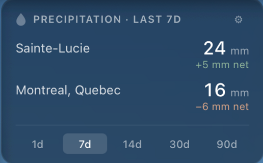

# rain_history_widget

An [Übersicht](https://tracesof.net/uebersicht/) widget that shows recent
precipitation totals for one or more places on your macOS desktop, using
[Open-Meteo](https://open-meteo.com/)'s free forecast and archive APIs.



* Multiple locations. Add any place via Open-Meteo's geocoding search; they stack in a single card.
* Time-window picker: 1d / 7d / 14d / 30d / 90d. Uses the forecast endpoint (`past_days`) for windows up to 92 days, archive endpoint beyond that.
* Locations and window selection are kept in `localStorage`, so they survive widget reloads.
* macOS-native styling: translucent dark card with backdrop blur, SF Pro typography, tabular numerals.

Default location is Sainte-Lucie-des-Laurentides, QC (46.13°N, 74.30°W).

## Why another weather widget?

Most Übersicht weather widgets answer "what's the weather right now, and
what's coming up?": current conditions, an icon, an N-day forecast. This one
answers a different question: "how much has actually fallen lately, and was it
enough to keep up with evaporation?"

* Backward-looking, not forecast. The primary number is the precipitation total over a configurable window. Useful if you're tracking what your garden, lawn, forest, or rain barrel has actually received, not what might happen tomorrow.
* Rain minus ET₀ (climatic water balance). Every total is paired with rain minus the FAO reference evapotranspiration, colour-coded for surplus or deficit. That's the number that matters for irrigation planning and drought tracking, and it isn't shown anywhere else in the gallery.
* Multi-location at a glance. Locations stack in one compact card with tabular-numeric alignment, so you can compare two places side by side.
* No API key, no signup. Open-Meteo's free public endpoints. Most existing widgets in the gallery depend on Dark Sky (shut down in 2023) or require an OpenWeatherMap key.

If you want current conditions, hourly forecasts, or a weather icon, there
are several good widgets for that already. This one is for the rain-curious.

## Quick start

```sh
git clone https://github.com/yfarjoun/rain_history_widget.git ~/.rain_history_widget
cd ~/.rain_history_widget
./install.sh
```

`install.sh` checks that Übersicht is installed (offering to install it via
Homebrew if not), then copies `rain.jsx` into Übersicht's widgets directory.
The widget appears within a second or two.

> Übersicht's file watcher ignores symlinks, so the installer copies the file
> instead. A bare `git pull` won't update the live widget; use `--update`
> below, which pulls and re-copies.

To update later:

```sh
cd ~/.rain_history_widget
./install.sh --update      # git pull + re-copy
```

To uninstall:

```sh
./install.sh --remove
```

## Installing Übersicht (if you don't have it)

Übersicht is a free macOS app that puts widgets on your desktop wallpaper.
You only need to install it once.

Option A, Homebrew (recommended):

```sh
brew install --cask ubersicht
```

(`install.sh` will offer to do this for you if it doesn't find Übersicht.)

Option B, direct download: get the latest release from
<https://tracesof.net/uebersicht/> and drag `Übersicht.app` into
`/Applications`.

After installing, launch the app once. Its icon lives in the menu bar
(top-right), which is also where errors and the widget list show up. If
macOS prompts you about Screen Recording or Accessibility permissions,
neither is needed for this widget; you can skip them.

## Manual install (no script)

If you'd rather not run `install.sh`:

```sh
cp rain.jsx ~/Library/Application\ Support/Übersicht/widgets/rain.jsx
```

Re-run that `cp` after a `git pull` to update. (Symlinks don't work; see above.)

## Using the widget

* The widget appears at top-left of the desktop by default. Drag the header
  to move it; the position is remembered across reloads.
* Click the gear icon to add or remove locations. The search box queries
  Open-Meteo's geocoding API and shows matches; click one to add it.
* Click any of the window buttons (1d / 7d / 14d / 30d / 90d) to change how
  far back the precipitation total covers.
* Your choices are saved to `localStorage`, so they persist across widget
  reloads, restarts, and updates.

## Troubleshooting

* Widget doesn't appear: open the Übersicht menu-bar icon, click "Open widgets
  directory", and confirm `rain.jsx` is there. The menu also surfaces any
  JavaScript errors.
* Values show `—`: Open-Meteo refused or returned no data. Hover the dash to
  see the HTTP error. Check your internet connection.
* Blur looks wrong or no transparency: older macOS versions may not support
  `backdrop-filter`. The card still renders with a solid semi-transparent
  background.

## How it works

* The widget uses Übersicht's native state API (`initialState`, `command`,
  `updateState`, `render`) rather than React hooks.
* Initial fetch runs in `command(dispatch)` on widget load. `refreshFrequency`
  is set to 6 hours, so Übersicht re-runs `command` on that schedule.
* User actions (changing the window, adding or removing a location) also
  trigger a fresh fetch directly from the render handlers.
* The geocoding API (`https://geocoding-api.open-meteo.com/v1/search?name=…`)
  returns lat/lon plus IANA timezone, which gets passed through to the data
  query so totals line up with the local calendar day.

## Customizing the default

Edit `DEFAULT_LOCATIONS` at the top of `rain.jsx` to change what appears the
first time the widget loads (before anything is saved to `localStorage`).
